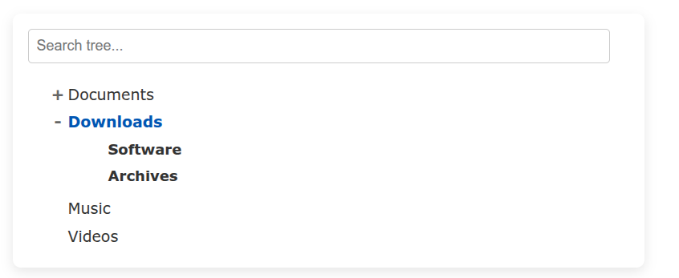

# Quercus.js

**A Lightweight and Customizable JavaScript Treeview Library with absolutely no dependencies**



(Screenshot)

Quercus.js (named after the botanical genus for oak trees) is a simple, yet powerful, JavaScript library for rendering hierarchical data as an interactive treeview. It comes with built-in search functionality, node selection, and smooth expand/collapse animations.

Here you can find a **[Live Demo](https://stefaneichert.github.io/quercus.js/)**


---

Features

* **Hierarchical Data Display:** Visually represents nested JSON data.
* **Dedicated Expand/Collapse:** Clicking the `+`/`-` icon expands and collapses nodes.
* **Node Selection:** Clicking on a node's text selects or deselects it. Multi-selection is enabled by configuration, no special key (like Ctrl/Cmd) is needed.
* **Search Functionality:** Quickly filter nodes based on their direct text content, highlighting matches and expanding relevant paths.
* **Smooth Animations:** Elegant expand and collapse transitions for a better user experience.
* **Customizable:** Easy to style with standard CSS.
* **Custom Node Rendering:** Nodes can be rendered using HTML and CSS based on their attributes.
* **Controls:** Control buttons for selecting/deselecting, expanding/collapsing the nodes.
* **Lightweight:** No external dependencies.

---

## Installation

To use Quercus.js in your project, simply copy the `treeview.js` and `treeview.css` files into your project's asset directory (e.g., `js/` and `css/`).

Then, link them in your HTML file:

```html
    <link rel="stylesheet" href="path/to/src/treeview.css">
    <script src="path/to/src/treeview.js"></script>
   ```

## Data

Quercus.js expects your data to be an array of objects, where each object represents a node. Nodes can have `children` arrays for nesting.

```javascript
const myTreeData = [
    {
        id: '1',
        name: 'Documents',
        children: [
            { id: '1.1', name: 'Reports', children: [
                { id: '1.1.1', name: 'Q1 Sales' },
                { id: '1.1.2', name: 'Q2 Marketing' }
            ]},
            { id: '1.2', name: 'Proposals', children: [
                { id: '1.2.1', name: 'New Client A' },
                { id: '1.2.2', name: 'Project Beta' }
            ]}
        ]
    },
    {
        id: '2',
        name: 'Images',
        children: [
            { id: '2.1', name: 'Vacation Photos' },
            { id: '2.2', name: 'Work Graphics' }
        ]
    },
    { id: '3', name: 'Videos' }
];
```

## HTML

In order to create a tree in your html you need one (or multiple) container(s) that will then contain the respective tree. 

```html
    <h2>First Tree</h2>
    <div id="myTreeview1"></div>

    <h2>Another Tree)</h2>
    <div id="myTreeview2" class="my-treeview-container-with-my-own-css"></div>
```

## JavaScript Initialization

Create a new `Treeview` instance, passing an options object.

```javascript
// Get references to your HTML container elements
const treeviewContainer1 = document.getElementById('myTreeview1');
const treeviewContainer2 = document.getElementById('myTreeview2');

// Initialize the first treeview (Multi-Select Enabled)
// Click node text to select/deselect. Click +/- to expand/collapse.
const tree1 = new Treeview({
    containerId: 'myTreeview1',   // ID of the HTML element to render the tree into
    data: myTreeData,             // Your hierarchical data
    searchEnabled: true,          // Enable the search bar (default: true)
    initiallyExpanded: false,     // Start with nodes collapsed (default: false)
    multiSelectEnabled: true,     // Enable multi-selection by clicking nodes
    onSelectionChange: (selectedNodesData) => { // Callback when selection changes
        console.log('Selected Nodes (Tree 1):', selectedNodesData);
        // Example: Update a display area with selected nodes
        // document.getElementById('output-area').textContent = JSON.stringify(selectedNodesData, null, 2);
    }
});

// Initialize a second treeview (Single-Select Only)
// Click node text to select. Click +/- to expand/collapse.
const tree2 = new Treeview({
    containerId: 'myTreeview2',
    data: myTreeData, // Can use the same data or different data
    searchEnabled: true,
    initiallyExpanded: true,     // This tree will start fully expanded
    multiSelectEnabled: false,   // Only one node can be selected at a time
    onSelectionChange: (selectedNodesData) => {
        console.log('Selected Node (Tree 2):', selectedNodesData.length > 0 ? selectedNodesData[0] : null);
        // Example: Update a display area with the single selected node
        // document.getElementById('output-area').textContent = JSON.stringify(selectedNodesData.length > 0 ? selectedNodesData[0] : null, null, 2);
    }
});
```

---

## `Treeview` Options

| Option              | Type          | Default     | Description                                                                                                                                                                                                                                                                                                    |
| :------------------ | :------------ | :---------- | :------------------------------------------------------------------------------------------------------------------------------------------------------------------------------------------------------------------------------------------------------------------------------------------------------------- |
| `containerId`       | `string`      | `null`      | **Required.** The ID of the HTML `div` element where the treeview will be rendered.                                                                                                                                                                                                                            |
| `data`              | `Array<Object>` | `[]`        | The array of node objects representing your hierarchical data.                                                                                                                                                                                                                                                  |
| `searchEnabled`     | `boolean`     | `true`      | If `true`, a search input field will be rendered above the treeview.                                                                                                                                                                                                                                          |
| `initiallyExpanded` | `boolean`     | `false`     | If `true`, all nodes will be expanded on initial load.                                                                                                                                                                                                                                                        |
| `multiSelectEnabled` | `boolean`    | `false`     | If `true`, clicking a node's text will toggle its selection (add to or remove from selection). If `false`, clicking a node will deselect all other nodes and select only the clicked one.                                                                                                                           |
| `onSelectionChange` | `function`    | `null`      | A callback function executed whenever the selected node(s) change. It receives an `Array<Object>` of all currently selected node data objects. If `multiSelectEnabled` is `false`, this array will contain at most one object. |
| `onRenderNode`      | `function`    | `null`      | A callback function for custom node rendering. It receives `nodeData` (the node's data object) and `nodeContentWrapperElement` (the `div` to populate). See "Custom Node Rendering" section below. |
| `showSelectAllButton` | `boolean`   | `false`     | If `true` and `multiSelectEnabled` is also `true`, a "Select All" / "Deselect All" button will be displayed above the tree, allowing bulk selection toggling of all nodes. |
| `showExpandCollapseAllButtons` | `boolean` | `false` | If `true`, "Expand All" and "Collapse All" buttons will be displayed above the tree, allowing bulk expansion or collapse of all nodes. |


---

## Public Methods

You can interact with your `Treeview` instance after it's been initialized:

* **`setData(newData: Array<Object>): void`**
    Updates the treeview with new data. Clears the existing tree and re-renders it, resetting any current selections.
    ```javascript
    const newTreeData = [{ id: '4', name: 'New Root', children: [{ id: '4.1', name: 'Sub Item' }] }];
    tree1.setData(newTreeData);
    ```
* **`getSelectedNodes(): Array<Object>`**
    Returns an array containing the data objects of all currently selected nodes. The array will be empty if no nodes are selected.

* **`search(searchTerm: string): void`**
    Programmatically performs a search on the treeview. The search input field will also update.
    ```javascript
    tree1.search('Q1'); // Will highlight 'Q1 Sales' and expand its parents
    ```
---
### Custom Node Rendering (`onRenderNode`)

Quercus.js allows you to fully customize the HTML content of each node by providing an `onRenderNode` callback function in the `Treeview` options. This is useful for adding icons, status indicators, additional data, or any complex HTML structure to your nodes.

**Callback Signature:**
```javascript
onRenderNode: (nodeData, nodeContentWrapperElement) => { /* ... populate nodeContentWrapperElement ... */ }
```
* `nodeData`: The full data object for the current node (as provided in your `data` array).
* `nodeContentWrapperElement`: The `div` DOM element (`.treeview-node-content`) that will contain your custom HTML. You should append your custom elements to this wrapper.

**Important Considerations:**

* **Clearing Content:** If using `setData` to update the tree, ensure you clear the `nodeContentWrapperElement.innerHTML` at the beginning of your `onRenderNode` function to prevent duplicate content.
* **Search Functionality:** To ensure search continues to work correctly with your custom rendering, make sure the `span` element that contains the primary searchable text (usually `nodeData.name`) also has the class `treeview-node-text`.
* **Expander Icon:** The expander icon (`+`/`-`) is automatically prepended by Quercus.js to the `nodeContentWrapperElement` if the node has children. You don't need to add it in your custom renderer.

**Example Usage (from `demo/index.html`):**

This example demonstrates adding an emoji icon and a description/status based on custom `type` and `status` properties in your node data.

```javascript
onRenderNode: (nodeData, nodeContentWrapperElement) => {
    // Clear existing content if any (important for setData calls)
    nodeContentWrapperElement.innerHTML = '';

    // Create an icon based on node type
    const iconSpan = document.createElement('span');
    iconSpan.classList.add('custom-node-icon'); // Apply custom CSS class for styling
    if (nodeData.type === 'folder') {
        iconSpan.textContent = '📁';
    } else if (nodeData.type === 'file') {
        iconSpan.textContent = '📄';
    } else if (nodeData.type === 'image') {
        iconSpan.textContent = '🖼️';
    } else {
        iconSpan.textContent = '▪️';
    }
    nodeContentWrapperElement.appendChild(iconSpan);

    // Create a span for the node name
    const nameSpan = document.createElement('span');
    nameSpan.classList.add('treeview-node-text', 'custom-node-name'); // Keep treeview-node-text for search
    nameSpan.textContent = nodeData.name;
    nodeContentWrapperElement.appendChild(nameSpan);

    // Add a description/status if available
    if (nodeData.description) {
        const descSpan = document.createElement('span');
        descSpan.classList.add('custom-node-description');
        descSpan.textContent = ` (${nodeData.description})`;
        nodeContentWrapperElement.appendChild(descSpan);
    } else if (nodeData.status) {
        const statusSpan = document.createElement('span');
        statusSpan.classList.add('custom-node-description');
        statusSpan.textContent = ` [${nodeData.status}]`;
        statusSpan.classList.add(nodeData.status === 'active' ? 'custom-node-status-active' : 'custom-node-status-inactive');
        nodeContentWrapperElement.appendChild(statusSpan);
    } else if (nodeData.size) {
        const sizeSpan = document.createElement('span');
        sizeSpan.classList.add('custom-node-description');
        sizeSpan.textContent = ` (${nodeData.size})`;
        nodeContentWrapperElement.appendChild(sizeSpan);
    }
}
```

## Styling

Quercus.js provides a base stylesheet (`src/treeview.css`) that you can customize to match your project's theme.

Key CSS classes for customization:

* `.custom-treeview-wrapper`: The main container for the treeview.
* `.treeview-search-input`: The search input field.
* `.custom-treeview-wrapper ul`: General list styling for all `ul` elements.
* `.custom-treeview-wrapper li`: The list item representing a node.
* `.custom-treeview-wrapper .treeview-node-content`: The `div` wrapper for the expander icon and node text; this is the primary clickable and styled area for selection/highlight.
* `.custom-treeview-wrapper .treeview-node-text`: The `span` containing the node's display name.
* `.treeview-expander`: The `+`/`-` icon for expandable nodes.
* `.treeview-expander-placeholder`: The empty `span` for leaf nodes, used for alignment.
* `.custom-treeview-wrapper li.selected > .treeview-node-content`: Styles applied to the node's content wrapper when the node is selected.
* `.custom-treeview-wrapper li.highlight > .treeview-node-content`: Styles applied to the node's content wrapper when it matches a search term.

Remember that search highlighting intelligently applies to only the direct matching node, and parents are expanded without inheriting the highlight style.

---


## License

This project is licensed under the [MIT License](LICENSE).

---

## Acknowledgements

This Quercus.js library was developed with the assistance of Gemini, a large language model trained by Google.